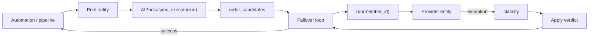

# Architecture

The whole design is one idea: **`AIPool.async_execute(run)` in `pool.py` is
provider-agnostic.** Platforms supply a `run(entity_id) -> Awaitable[T]`
callable that does the real work against one member. Every decision about
*which* member and *what to do when it fails* lives in the pool.

Adding routing behaviour means touching `pool.py`, never the four platform
files.



`entry.runtime_data` holds the `AIPool`. Pool type is immutable after creation
because it decides which platform loads; any options change triggers a full
reload.

## Request path

1. A platform adapter builds `run` (call this member the way Home Assistant
   would) and calls `async_execute`.
2. The store rolls the local day if needed — one of exactly two call sites
   that may mutate day counters. The other is a midnight
   `async_track_time_change`. Sensors and `snapshot` stay read-only: they
   compare against `store.today()` instead of rolling.
3. Members are split into a preferred group and a last-resort group
   (exhausted, cooling, throttled, unavailable). Declared limits only
   **reorder**. A member is never dropped except `disabled` (auth).
4. `order_candidates()` ranks the preferred group, then the last-resort
   group, using the configured strategy.
5. The round-robin cursor advances by one modulo `CURSOR_MODULUS` (2520),
   not modulo the live queue length — taking it modulo a shrinking group
   used to skew rotation.
6. For each candidate, `run(entity_id)` is awaited with the pool timeout.
   The attempt is recorded *before* the call: the provider charges the
   request when it receives it, not when it answers.
7. On exception, `classify()` maps the message to a `FailureKind`. QUOTA is
   matched before AUTH: providers return spent allowances as `403` as readily
   as `429`, and AUTH is the only permanent verdict.
8. A capacity `503` on one API key does **not** skip other keys. Only other
   members of the **same config entry** on that model are skipped for the
   rest of *this* request. A skip is not charged as an attempt.
9. On success, `calls_today` increments, cooldown strikes reset, listeners
   fire (sensors refresh). Routing uses this optimistic counter on purpose:
   an announcement that fails loudly beats one that never runs.

## Modules

| Module | Role |
| ------ | ---- |
| `pool.py` | `AIPool`: member selection, the failover loop, verdicts, events, repairs. |
| `errors.py` | `classify()` — exception/message → `FailureKind`. Pure, no HA imports. |
| `strategies.py` | `order_candidates()` over plain `Candidate` data. No HA instance. |
| `store.py` | Persisted counters, day rollover, rolling per-minute request log. |
| `views.py` | `MemberView` — frozen read model for sensors, diagnostics and tests. |
| `models.py` | Heuristic model and provider `config_entry_id` (subentry first). `shared_account_models()` is the duplicate predicate. |
| `config_flow.py` | Create + options. Pool type chosen once. STT buffer shown in MB, stored in bytes. |
| `entity.py` | Shared identity. Names the pool entity explicitly (`entry.title`). |
| `__init__.py` | Loads one platform plus sensors; `ai_pool.reset_member`; prunes orphan member sensors. |
| `ai_task.py` / `conversation.py` / `tts.py` / `stt.py` | Thin adapters: build `run`, call `async_execute`, translate the result. |
| `sensor.py` / `binary_sensor.py` | Diagnostics only. Latency sensors are disabled by default. |
| `diagnostics.py` | Config-entry dump. Nothing to redact: the pool holds no credentials. |

## Why adapters stay thin

```python
async def run(member: str) -> ai_task.GenDataTaskResult:
    return await ai_task.async_generate_data(
        self.hass,
        task_name=task.name,
        entity_id=member,
        instructions=task.instructions,
        ...
    )

result = await self.pool.async_execute(
    run, description="generate_data", size=len(task.instructions)
)
```

The adapter knows how to talk to one Home Assistant domain. It does not know
about quotas, cooldowns, or which member is next. That split is what lets four
pool types share one failover loop.

## Accounts, not names

Two Google keys on `gemini-flash-latest` are two daily counters. Two entities
of **one** config entry on that model are the same membership listed twice.

The duplicate-model repair fires only for the same-account case.
`duplicate_models()` reads live `member_model` / `member_config_entry_id`, not
the sensor cache — a repair that lagged an options change used to keep warning
about an account the user had just split. An unreadable model or account is
`None` and concludes nothing.

## How state is updated

| What changes | How sensors see it |
| ------------ | ------------------ |
| A call succeeds or fails | The pool notifies listeners; metric sensors write state immediately (`should_poll = False`). |
| A cooldown expires, or a member entity goes unavailable | Nothing calls the pool. The **problem sensor** polls once a minute. |
| Local midnight | `async_track_time_change` rolls day counters. Until the next request or poll, read paths compare against `store.today()`. |

Latency sensors exist in the entity registry but start **disabled**: one
measurement per member on every success is too noisy for the default
dashboard. Calls, fallback rate and the problem sensor stay on.

The pool entity itself stays **available** even when no member can serve.
Trouble is the problem sensor and the `ai_pool_failover` /
`ai_pool_exhausted` events, not `unavailable` — a call must still be able to
fail loudly.

## Persistence

`UsageStore` writes counters to Home Assistant storage keyed by config entry.
A restart at 18:00 does not hand a spent member a fresh allowance. Schema
migration hooks currently do nothing: they exist so the first version bump
does not break entries.

Reloading the entry re-admits disabled members (`clear_disabled`). That, and
`ai_pool.reset_member`, are the only escapes from an auth disable.

## Invariants that tests pin

These are load-bearing. Changing them without updating tests is a bug.

- Exhausted / cooling / throttled members are demoted, not dropped.
- QUOTA patterns match before AUTH.
- Round-robin cursor modulo 2520, not queue length.
- Day roll has two call sites only (request path + midnight).
- Cooldown doubles per consecutive capacity refusal; only success resets it.
- Capacity skip is per account, not per model.
- Pool entities are excluded from member pickers (`_own_entities`).
- STT buffer: megabytes in the form, bytes in storage.
- Fallback rate is `unknown` when `requests_today` is 0.
